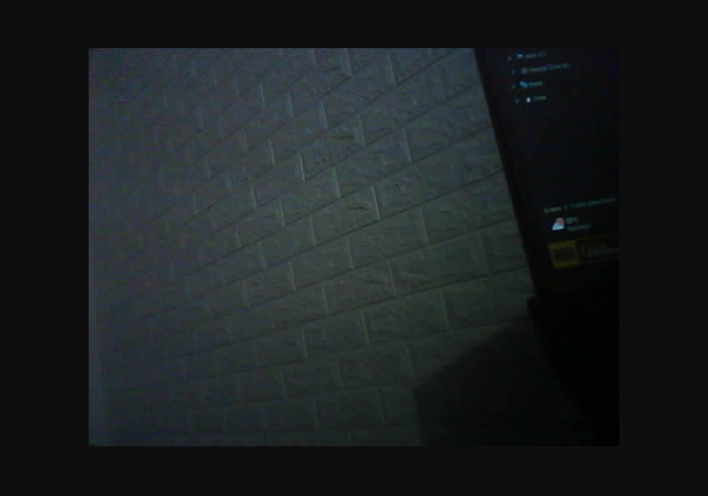

# _Detector Dracco_

---

## Sumário

- [Histórico de Versão](#histórico-de-versão)
- [Resumo](#resumo)
- [Objetivo](#Objetivo)
- [Requisitos](#requisitos)
- [Informações Adicionais](#informações-adicionais)
    - [Configuração do Ambiente](#configuração-do-ambiente)
    - [Orange Pi](#orange-pi)
    - [ESP32-CAM](#esp32-cam)

## Histórico de Versão

| Versão | Data       | Autor       | Descrição         |
|--------|------------|-------------|-------------------|
| 1.0.0  | 14/03/2026 | Adenilton R | Início do Projeto |

# Resumo

Este projeto consiste em um sistema inteligente de monitoramento utilizando **visão computacional** para detectar a presença de gatos em uma área monitorada.

A captura de vídeo é realizada por uma **ESP32-CAM**, que transmite o stream da câmera pela rede local. O processamento das imagens é feito por um **Orange Pi Zero 3**, responsável por executar um modelo de **reconhecimento de imagens** para identificar gatos em tempo real.

Quando o sistema identifica a presença de um gato, diferentes ações podem ser executadas automaticamente:

- Envio de notificação via **Telegram**
- Disparo de uma **rotina na Alexa para reproduzir um alerta de voz**
- Registro do evento no sistema de **logs**

O sistema também conta com uma **interface web desenvolvida em Flask**, que permite configurar parâmetros do sistema, definir áreas de detecção, selecionar áudios de alerta e monitorar a câmera remotamente.

# Objetivo

Os principais objetivos do projeto são:

- Desenvolver um sistema de **detecção automática de gatos utilizando visão computacional**.
- Integrar hardware embarcado (**ESP32-CAM e Orange Pi Zero 3**) para captura e processamento de imagens.
- Implementar um **modelo de detecção de objetos em tempo real**.
- Disparar um **alerta de voz através da Alexa** quando um gato for detectado.
- Enviar notificações remotas via **Telegram**.
- Criar uma **interface web para configuração e monitoramento do sistema**.
- Registrar eventos e permitir análise posterior através de **logs do sistema**.

# Requisitos

## Hardware

- ESP32-CAM (captura de vídeo)
- Orange Pi Zero 3 (processamento de visão computacional)
- Dispositivo **Amazon Alexa (Echo)** para reprodução dos alertas
- Fonte de alimentação adequada
- Rede Wi-Fi local

## Software

### Orange Pi

- Linux (Debian / Ubuntu / Armbian)
- Python 3
- Flask
- OpenCV
- Framework de visão computacional (ex: YOLO)
- Biblioteca para integração com **Telegram**
- Script para disparo de **rotinas Alexa**

### ESP32

- Framework **ESP-IDF**
- Firmware para captura de vídeo
- Stream de câmera via HTTP ou RTSP

## Informações Adicionais

### Configuração do Ambiente

Para obter mais informações sobre o projeto, clique no [**link**](https://github.com/AdeniltonR/Detector-Dracco/tree/main/Config-ambiente) a seguir.

### Orange Pi

Para obter mais informações sobre o projeto do Software, clique no [**link**](https://github.com/AdeniltonR/Detector-Dracco/tree/main/Software) a seguir.

### ESP32-CAM

Para obter mais informações sobre o projeto do Firmware, clique no [**link**](https://github.com/AdeniltonR/Detector-Dracco/tree/main/Firmware/esp32_cam) a seguir.

