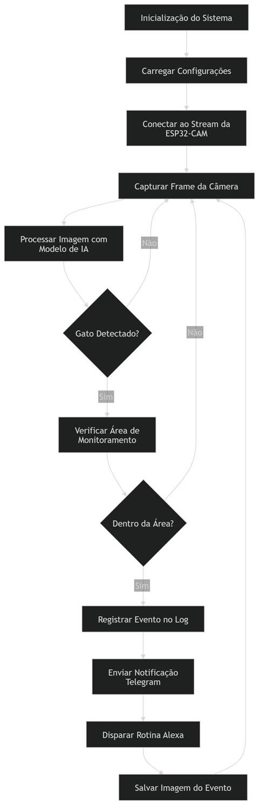
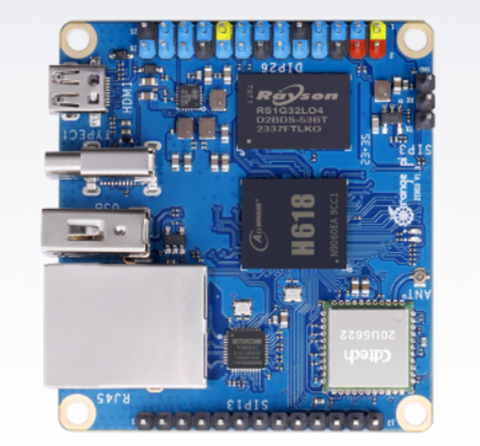

# _Software Detector_


---

## Sumário

- [Histórico de Versão](#histórico-de-versão)
- [Introdução](#introdução)
- [Objetivo](#objetivo)
- [Estrutura do Projeto](#estrutura-do-projeto)
- [Links de Estudo](#links-de-estudo)
- [Fluxograma](#fluxograma)
- [Instale Git](#instale-git)
  - [Configuração Básica do Git](#configuração-básica-do-git)
- [Ambiente Virtual com venv no Orange Pi](#ambiente-virtual-com-venv-no-orange-pi)
  - [Instale o Python](#instale-o-python)
  - [Crie um Ambiente Virtual](#crie-um-ambiente-virtual)
  - [Ative o Ambiente Virtual](#ative-o-ambiente-virtual)
  - [Instale Pacotes](#instale-pacotes)
  - [Desative o Ambiente Virtual](#desative-o-ambiente-virtual)
  - [Remover o Ambiente Virtual](#remover-o-ambiente-virtual)
  - [Notas Adicionais](#notas-adicionais)
  - [Pacotes Python](#pacotes-python)
- [Explicação dos módulos eletrônico](#explicação-dos-módulos-eletrônico)
  - [Orange Pi](#orange-pi)
- [Configuração de Software](#configuração-de-software)
- [Automatizar processo abrir automatico quando máquina reniciar](#automatizar-processo-abrir-automatico-quando-máquina-reniciar)
- [Script de controle do serviço](#script-de-controle-do-serviço)
    - [1 Criar o arquivo do script](#1-criar-o-arquivo-do-script)
    - [2 Dar permissão de execução](#2-dar-permissão-de-execução)
    - [3 Como usar](#3-como-usar)
    - [4 Quer deixar o script acessível em qualquer lugar](#4-quer-deixar-o-script-acessível-em-qualquer-lugar)
- [Informações](#informações)

## Histórico de versão

| Versão | Data       | Autor        | Descrição              |
|--------|------------|--------------|------------------------|
| 1.0.0  | 14/03/2026 | Adenilton R  | Início do Projeto      |

## Introdução

Este documento descreve o software embarcado que será executado no **Orange Pi Zero 3**, componente responsável pelo processamento de imagens provenientes da **ESP32-CAM**, execução do algoritmo de **visão computacional**, gerenciamento de notificações e disponibilização de uma interface web para configuração e monitoramento do sistema.

O sistema faz parte de uma solução de **monitoramento inteligente baseada em reconhecimento de imagens**, com a finalidade de detectar automaticamente a presença de gatos em uma área monitorada e executar ações configuradas pelo usuário.

A **ESP32-CAM** é responsável pela captura e transmissão do vídeo pela rede local, enquanto o **Orange Pi Zero 3 atua como núcleo de processamento de alto nível**, recebendo o stream da câmera, executando o modelo de detecção de objetos, gerenciando notificações e registrando eventos do sistema.

Quando um gato é identificado na área monitorada, o sistema pode executar automaticamente diferentes ações, como **envio de notificações via Telegram**, **disparo de rotinas na Alexa para emissão de alertas sonoros**, além de registrar os eventos em um sistema de **logs para rastreabilidade e análise posterior**.

O sistema também disponibiliza uma **interface web desenvolvida em Flask**, que permite configurar parâmetros de detecção, visualizar o stream da câmera, selecionar alertas e monitorar o funcionamento do sistema.

## Objetivo

Desenvolver um software em **Python para o Orange Pi Zero 3** com as seguintes funcionalidades:

1. **Recepção do Stream da ESP32-CAM**
    - Conectar ao stream de vídeo transmitido pela ESP32-CAM pela rede local;
    - Capturar frames da câmera em tempo real para processamento;
    - Disponibilizar o vídeo para visualização na interface web do sistema.
2. **Processamento de Imagens e Detecção de Objetos**
    - Executar um modelo de visão computacional (ex.: YOLO) para identificar gatos na imagem;
    - Processar continuamente os frames recebidos do stream de vídeo;
    - Detectar a presença de gatos dentro de uma área configurada de monitoramento.
3. **Sistema de Notificações**
    - Enviar mensagens automáticas via **Telegram** quando um gato for detectado;
    - Disparar rotinas configuradas na **Alexa** para emissão de alertas sonoros;
    - Permitir a configuração dos tipos de alerta através da interface do sistema.
4. **Interface Web de Configuração**
    - Disponibilizar uma interface web desenvolvida em **Flask** para configuração e monitoramento do sistema;
    - Permitir visualizar o stream da câmera em tempo real;
    - Configurar parâmetros de detecção e área de monitoramento;
    - Selecionar ou configurar os alertas que serão executados em caso de detecção.
5. **Registro de Eventos (Logs)**
    - Registrar eventos importantes do sistema, como detecção de gatos, envio de notificações e disparo de alertas;
    - Armazenar informações de data e hora para rastreabilidade dos eventos;
    - Permitir análise posterior do funcionamento do sistema.
6. **Execução Automática do Sistema**
    - Inicializar automaticamente o software durante o boot do **Orange Pi Zero 3**;
    - Garantir funcionamento contínuo do sistema de monitoramento sem necessidade de intervenção manual.

## Estrutura do Projeto

Aqui está uma visão geral da estrutura básica do projeto:

```
dracco-detector/
│
├── README.md                    # Descrição do projeto e instruções de uso
├── requirements.txt             # Dependências do projeto (pyserial, etc.)
├── main.py                      # Inicialização do sistema
│
├── src/                         # Módulos principais (como pacotes Python)
│   ├── camera/                  # Captura do stream da ESP32-CAM
│   │   ├── __init__.py
│   │   └── camera_stream.py
│   │
│   ├── detection/               # Algoritmo de visão computacional
│   │   ├── __init__.py
│   │   └── object_detection.py
│   │
│   ├── notifications/           # Integração com Telegram e Alexa
│   │   ├── __init__.py
│   │   ├── telegram.py
│   │   └── alexa.py
│   │
│   ├── web/                     # Interface web Flask
│   │   ├── __init__.py
│   │   ├── app.py
│   │   ├── templates/
│   │   │   ├── homepage.html
│   │   │   ├── index.html
│   │   │   └── ...
│   │   └── static/
│   │       ├── imagens.png
│   │       └── ...
│   │
│   └── utils/                   # Funções auxiliares (log, timestamp, etc.)
│       ├── __init__.py
│       └── helpers.py
│
├── config/                      # Arquivos de configuração
│   └── config.yaml
│
├── logs/                        # Registro de eventos do sistema
│
├── models/                      # Modelos de IA utilizados no sistema
│
└── scripts/                     # Scripts auxiliares (testes, ferramentas)
    └── cam.py
```

## Links de Estudo

## Fluxograma



## Instale Git

Instale o Git com o seguinte comando:

```basic
sudo apt install git -y
```

Para garantir que o Git foi instalado corretamente, verifique a versão instalada com:

```basic
git --version
```

### Configuração Básica do Git

Após a instalação, é importante configurar o Git usando SSH:

[Link do vídeo explicando;](https://www.youtube.com/watch?v=xN3Hl4syCjs)

[Link de um artigo;](https://willianjusten.com.br/configurando-2-contas-de-git-no-mesmo-computador)

## Ambiente Virtual com venv no Orange Pi

Para criar e gerenciar um ambiente virtual usando `venv` no Orange Pi, siga os passos abaixo:

### Instale o Python

Certifique-se de que o Python está instalado no seu Orange Pi. A maioria das distribuições do Orange Pi já vem com o Python pré-instalado. Caso precise instalar ou atualizar, execute, v3.11.2:

```bash
sudo apt update
sudo apt install python3 python3-venv
```

### Crie um Ambiente Virtual

1. Abra um Terminal no Orange Pi**.**
2. Navegue até sua pasta para clonar o projeto:
    
    ```basic
    cd Documents/Projetos/
    ```
    
3. Clone o repositorio:
    
    ```basic
    git clone https://github.com/AdeniltonR/Detector-Dracco.git
    ```
    
4. Navegue até a pasta Software:
    
    ```basic
    cd Detector-Dracco/Software
    ```
    
5. **Execute o Comando para Criar o Ambiente Virtual:**
    - Substitua `nome_do_seu_ambiente` pelo nome desejado para o seu ambiente virtual, nome do meu ambiente é `dracco`.
    
    ```bash
    python3 -m venv dracco
    ```
    
    Isso criará uma pasta chamada `nome_do_seu_ambiente` contendo o ambiente virtual.
    

### Ative o Ambiente Virtual

Para ativar o ambiente virtual, execute o comando apropriado para o seu sistema:

```bash
source dracco/bin/activate
```

Após a ativação, você verá o nome do ambiente virtual aparecer no prompt do terminal, indicando que você está trabalhando dentro do ambiente virtual.

### Instale Pacotes

Com o ambiente virtual ativado, você pode instalar pacotes usando `pip`. Por exemplo:

```bash
pip install nome_do_pacote
```

### Desative o Ambiente Virtual

Para desativar o ambiente virtual e retornar ao ambiente global do Python, execute:

```bash
deactivate
```

### Remover o Ambiente Virtual

Se você precisar excluir o ambiente virtual, basta remover a pasta que foi criada. No exemplo acima, você pode excluir a pasta `nome_do_seu_ambiente`:

```bash
rm -rf nome_do_seu_ambiente
```

### Notas Adicionais

- **Gerenciamento de Pacotes:**
    - Use `pip list` para listar pacotes instalados e `pip freeze` para gerar um arquivo `requirements.txt` com as dependências do projeto.
- **Arquivo `requirements.txt`:**
    - Para gerar um arquivo `requirements.txt`, execute:
        
        ```bash
        pip freeze > requirements.txt
        ```
        
    - Para instalar pacotes a partir de um `requirements.txt`, use:
        
        ```bash
        pip install -r requirements.txt
        ```
        

Para ativar o ambiente virtual, execute o comando apropriado para o seu sistema:

```bash
source dracco/bin/activate
```

Para desativar o ambiente virtual e retornar ao ambiente global do Python, execute:

```bash
deactivate
```

### Pacotes Python

[Flask](https://flask.palletsprojects.com/en/3.0.x/), v3.0.3

```bash
pip install Flask
```

[OpenCV](https://pypi.org/project/opencv-python/), v4.10.0.84

```bash
pip install opencv-python
```

## Estrutura de pasta e arquivos

Aqui está uma visão geral da estrutura básica do projeto:

```
dracco-detector/
│
├── README.md                    # Descrição do projeto e instruções de uso
├── requirements.txt             # Dependências do projeto (pyserial, etc.)
├── main.py                      # Inicialização do sistema
│
├── src/                         # Módulos principais (como pacotes Python)
│   ├── camera/                  # Captura do stream da ESP32-CAM
│   │   ├── __init__.py
│   │   └── camera_stream.py
│   │
│   ├── detection/               # Algoritmo de visão computacional
│   │   ├── __init__.py
│   │   └── object_detection.py
│   │
│   ├── notifications/           # Integração com Telegram e Alexa
│   │   ├── __init__.py
│   │   ├── telegram.py
│   │   └── alexa.py
│   │
│   ├── web/                     # Interface web Flask
│   │   ├── __init__.py
│   │   ├── app.py
│   │   ├── templates/
│   │   │   ├── homepage.html
│   │   │   ├── index.html
│   │   │   └── ...
│   │   └── static/
│   │       ├── imagens.png
│   │       └── ...
│   │
│   └── utils/                   # Funções auxiliares (log, timestamp, etc.)
│       ├── __init__.py
│       └── helpers.py
│
├── config/                      # Arquivos de configuração
│   └── config.yaml
│
├── logs/                        # Registro de eventos do sistema
│
├── models/                      # Modelos de IA utilizados no sistema
│
└── scripts/                     # Scripts auxiliares (testes, ferramentas)
    └── cam.py
```

## Explicação dos módulos eletrônico

### Orange Pi Zero 3

O [**`Orange Pi Zero 3`**](http://www.orangepi.org/html/hardWare/computerAndMicrocontrollers/details/Orange-Pi-Zero-3.html) é equipado com o processador Allwinner H618, um quad-core Cortex-A53, e GPU Arm Mali-G31 MP2, oferecendo suporte a gráficos como OpenGL ES e Vulkan. Ele tem opções de memória que variam de 1 GB a 4 GB e suporta decodificação de vários formatos de vídeo, com saída Micro-HDMI para exibição 4K. Além disso, a placa pode ser expandida com uma variedade de funções como fones de ouvido, TVout, USB 2.0 e recepção IR, usando portas de expansão de 13 e 26 pinos, aumentando as capacidades de conectividade e interface.



**Informações Técnicas:**

- **`CPU:`** Processador Allwinner H618 Quad-core Cortex-A53 1.5GHz;
- **`GPU:`** Mali G31 MP2, suporta OpenGL ES 1.0/2.0/3.2, OpenCL 2.0, Vulkan 1.1;
- **`Memória:`** Memória LPDDR4 disponível em 1 GB, 1.5 GB, 2 GB, ou 4 GB;
- **`Armazenamento a bordo:`** 16 MB de memória flash SPI;
- **`Gerenciamento de energia:`** AXP313A;
- **`Wi-Fi + Bluetooth integrado:`** Suporta WiFi5 e Bluetooth 5.0;
- **`Rede:`** Interface Ethernet 10M/100M/1000M;
- **`Entrada/saída de áudio:`** Porta de expansão de 13 pinos suporta saída de 2 canais e entrada de 1 canal;
- **`Saída de vídeo:`**
    - Micro HDMI até 4K a 60 fps;
    - Saída de TV: 13 pinos suporta saída de TV CVBS de 1 canal;
- **`UART:`** UART de depuração de 3 pinos;
- **`USB:`** USB 2.0 x3 (dois dos quais vêm da placa de expansão);
- **`Interface de cartão SD:`** Interface de cartão Micro SD;
- **`Interface de expansão:`**
    - Interface GPIO de 26 pinos;
    - Interface GPIO de 13 pinos;
- **`Entrada de energia:`** 5V3A, conector tipo C;
- **`Sistema Operacional suportado**:` Android 12 TV, Debian 11, Debian 12, Ubuntu 22.04, Ubuntu 20.04;
- **`Dimensões do PCB:`** 50 mm x 55 mm;

## Configuração de Software

## Automatizar processo abrir automatico quando máquina reniciar

## Script de controle do serviço

### 1 Criar o arquivo do script

### 2 Dar permissão de execução

### 3 Como usar

### 4 Quer deixar o script acessível em qualquer lugar

## Informações

| Software | Versão  |
|----------|---------|
| Python   | v3.11.2 |